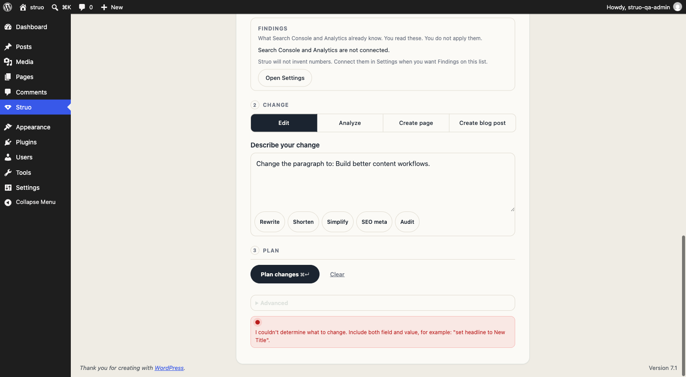

# Struo

[](https://github.com/rremedio-web/struo-public/actions/workflows/ci.yml)

Agents may plan. Only a person applies.

Struo is a WordPress plugin for AI-assisted Gutenberg and ACF edits. Every change goes through **plan → preview → approve → apply**. Fail-closed page and block allowlists, durable plans, human approval, audit records, and provider protections. Autonomous tools cannot cash in a write token.

Requires **WordPress 6.9** (Abilities API) and **PHP 8.2**. WordPress 7.0 Client / Connectors are used when present. This is a lab plugin, not a hosted product. Fresh installs are fail-closed: no pages are editable until an administrator allowlists them.

## Installation

1. Copy the `struo` folder to `wp-content/plugins/`.
2. Activate per site (not as a network plugin).
3. Open **Settings → Struo**. Allowlist the pages the console may touch.

## Configuration

Prefer secrets in `wp-config.php`. A key saved in the database is plaintext. The settings field never shows a saved key. Leave it empty to keep the current value; use **Remove the saved API key** to delete it.

```php
define( 'STRUO_OPENAI_API_KEY', 'sk-...' ); // preferred
// define( 'STRUO_OPENAI_BASE_URL', 'https://api.openai.com/v1' );
// define( 'STRUO_OPENAI_MODEL', 'gpt-4o-mini' );
// define( 'STRUO_ALLOW_INSECURE_PROVIDER_URL', true ); // localhost HTTP only
```

On WordPress 7, Auto uses the site AI Client / Connectors. The OpenAI-compatible HTTP hop is last resort. That hop uses a 45s timeout and does not follow redirects, so the bearer key is never sent to another host.

## Two-minute demo

1. Allowlist a page under Settings → Struo.
2. Open **Struo** in the admin menu (Mission Brief).
3. Name the page, describe a change such as “set the heading to Build better content workflows”, then **Plan**.
4. Review the diff. **Approve**, then **Apply**. Nothing is written until Apply.
5. The Work Queue card shows saved-to-WordPress versus the public page. Agents still cannot apply.



REST and MCP planning responses do not contain a redeemable write token. Direct persist is `sae_plan_apply_required`. Persist is durable `plan_id` → approve → apply.

## Endpoints

Namespace: `/wp-json/struo/v1`. Full map: [docs/rest-api.md](docs/rest-api.md).

### `GET /wp-json/struo/v1/block-catalog`

Allowlisted blocks with schemas. When `block-manifest.json` is present, each block includes `policy` metadata.

Demo ACF names in the shipped manifest: `acf/hero`, `acf/testimonials`, `acf/feature-grid`, `acf/faq`, `acf/call-to-action`.

### `GET /wp-json/struo/v1/posts/<post_id>/blocks`

Parsed block tree with index paths and extracted fields.

### `POST /wp-json/struo/v1/plan`

Builds a dry-run-ready plan from request text or a structured `plan` object.

```json
{
  "request": "Update the hero headline on the product page to \"Build better content workflows\"",
  "dry_run_preview": true,
  "prefer_ai": false
}
```

Request `planner_options` (`envId`, `model`, `temperature`, `maxTokens`) are ignored. Model and host come from administrator settings and constants only.

### `POST /wp-json/struo/v1/posts/<post_id>/blocks/insert`

```json
{
  "block_name": "acf/hero",
  "fields": {
    "heading": "Build better content workflows"
  },
  "position": { "type": "append" },
  "dry_run": true
}
```

Writes are rejected unless they go through an approved durable plan.

### `POST /wp-json/struo/v1/console/agent-plans/{id}/preview`

Preview a waiting plan. Create plans use `intent=create`, `payload_type=page_spec_v1`, and do not include `serialized_content`.

## WordPress Abilities (6.9)

Struo registers `struo/get-block-catalog`, `struo/get-post-blocks`,
`struo/plan-block-change`, and dry-run `struo/preview-*` abilities.
Reads and plan are MCP-public; previews are not. Apply is a private
ability (`struo/apply-agent-plan`, not MCP-public) plus REST/console
`plan_id` → approve → apply. Policy: [docs/abilities.md](./docs/abilities.md).

## MCP Tools (AI Engine)

- `struo_get_block_catalog`
- `struo_list_post_blocks`
- `struo_plan_block_change`
- `struo_insert_block`
- `struo_update_block`
- `struo_remove_block`
- `struo_apply_batch`

MCP-originated calls are dry-run only. Applying requires a person in the console.

## Audit storage

- Audit entries go to `{wp_prefix}sae_audit_log`.
- A privacy export returns only the requested user’s rows.
- If table writes fail, the plugin falls back to a small option ring buffer.

## Docs

- [Architecture](docs/architecture.md)
- [Security model](docs/security-model.md)
- [REST API](docs/rest-api.md)
- [Development](docs/development.md)
- [Testing](docs/testing.md)
- [Security reports](SECURITY.md)
- [Contributing](CONTRIBUTING.md)

## License

GPL-2.0-or-later. See [LICENSE](LICENSE).
